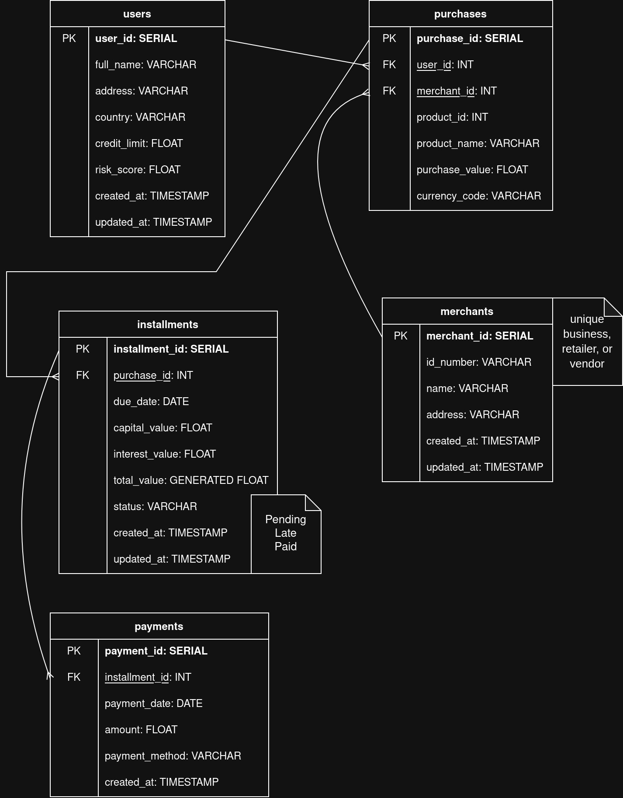

# bnlp-data-platform-example --WIP--

This is a small practice data engineering project that intends to build a system that produces BNLP-related data, passes it through an ETL pipeline to standardize it, and loads consumer-ready data into a Postgres Data Warehouse

## Configuration

Use a .env file at the project's root to specify the following variables:

- DB_USER
- DB_PASS
- DB_NAME
- DB_CONN
- _AIRFLOW_WWW_USER_USERNAME
- _AIRFLOW_WWW_USER_PASSWORD
- AIRFLOW_PROJ_DIR
- AIRFLOW_UID
- AIRFLOW_GID
- FERNET_KEY

## Execution

- Make sure you have a Docker service up and running
- Run `docker compose up` to run the whole system
- If automatic initialization doesn't work, run `docker compose up airflow-init` to create initial configurations (only done once) and then try to run the whole system again

You should be able to run Airflow's UI at http://localhost:8080 after the startup process finishes (healthy apiserver service)

## Data Platform Automatization

The platform is orchestrated by the `run_data_platform` DAG, which generates data into the raw layer schema of the Postgres Database, and then via DBT it will perform an ETL that stores data respectively of each stage of the Medallion Architecture (bronze, silver, and gold layers)

## Notes

- Airflow docker compose file has been taken from 'https://airflow.apache.org/docs/apache-airflow/3.2.2/docker-compose.yaml'

- Input Database ERD:

